# Руководство пользователя сервисом TraficData

Данное руководство описывает работу с веб‑сервисом **TraficData**, предназначенным для анализа пассажиропотока и планирования транспортной инфраструктуры на интерактивной карте.

При первом входе на сайт пользователю автоматически показывается краткое пошаговое руководство. Ниже приведена расширенная версия этого руководства с подробными пояснениями и иллюстрациями.

---

## 1. Стартовое краткое руководство

После открытия сервиса отображается окно с кратким руководством из трёх шагов.

### 1.1. Шаг «Просмотр информации»

На этом шаге объясняется, как посмотреть данные по существующей метке.  
Для просмотра информации достаточно один раз нажать на метку на карте (single tap / один клик).

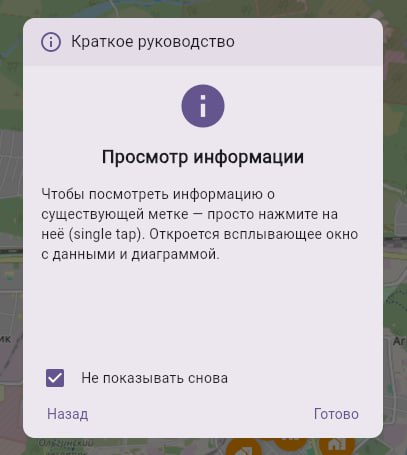

### 1.2. Шаг «Отображение значков»

Значки маршрутов и точек фильтруются по времени рейса.  
В подсказке показано, что время выбирается через иконку часов в правой верхней части экрана.

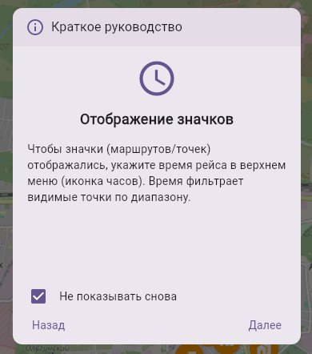

### 1.3. Шаг «Добавление метки»

Последний шаг краткого руководства показывает, как добавить новую метку: для этого нужно дважды нажать по месту на карте (double‑tap / двойной клик).

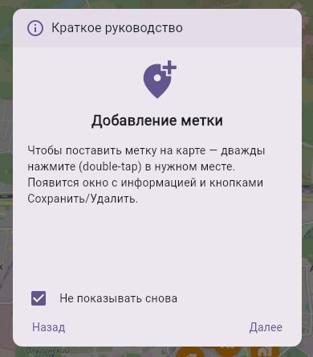

Внизу окна краткого руководства есть опция **«Не показывать снова»**. Если установить галочку, гайд больше не будет появляться автоматически.

---

## 2. Отображение точек маршрута на карте

### 2.1. Выбор времени следования маршрута

При входе на сайт карта может быть пустой или содержать ограниченное количество точек.  
Для отображения точек конкретного маршрута необходимо сначала указать **время следования маршрута**.

1. Перейдите в правый верхний угол страницы.
2. Нажмите на иконку часов.
3. Выберите нужное время или интервал времени.

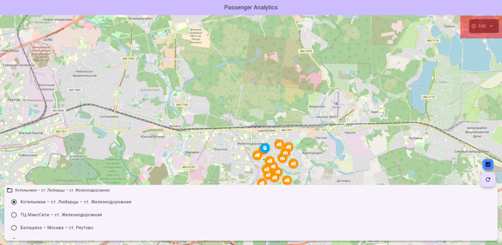

Выбранное время используется как фильтр: на карте будут показаны только те точки и маршруты, которые актуальны для указанного времени.

### 2.2. Выбор маршрута из списка

После выбора времени необходимо выбрать маршрут, с которым вы хотите работать.

1. В нижней части сайта расположен список доступных маршрутов.
2. Нажмите на нужный маршрут один раз левой кнопкой мыши.
3. Строка выбранного маршрута подсветится.

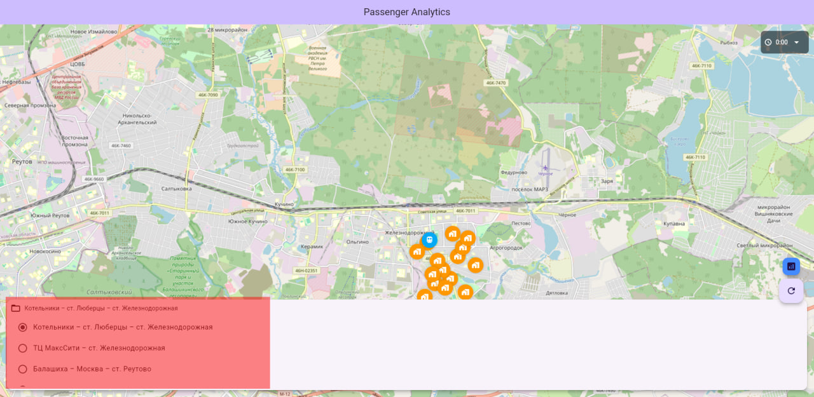

После выбора маршрута на карте отображаются остановки и другие точки, относящиеся к этому маршруту.

---

## 3. Добавление новой точки на выбранном маршруте

### 3.1. Выбор маршрута

Перед добавлением новой точки обязательно выберите маршрут в нижней части экрана (см. раздел 2.2). Новая точка будет относиться именно к выбранному маршруту.

### 3.2. Установка точки на карте

1. Найдите место на карте, где требуется добавить точку остановки.
2. Нажмите **дважды** по выбранному месту:
   - на ПК — двойной клик левой кнопкой мыши;
   - на мобильном устройстве — двойной тап.
3. Откроется окно с параметрами новой точки.

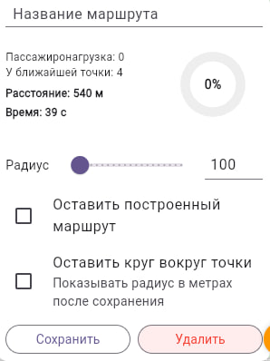

### 3.3. Параметры новой точки

В окне параметров отображается:

- **Название маршрута**.
- **Пассажиронагрузка** по маршруту.
- **Пассажиронагрузка у ближайшей точки**.
- **Расстояние** от ближайшей существующей точки до новой.
- **Время в пути** между точками.
- **Круговая диаграмма** с процентом целесообразности размещения новой точки.

Процент на диаграмме показывает, насколько целесообразно размещение данной остановки с учётом:

- окружающей инфраструктуры;
- нормативно‑правовых актов РФ (НПА РФ);
- текущей конфигурации маршрута.

Слева от диаграммы дополнительно выводятся числовые параметры, влияющие на расчёт.

### 3.4. Настройка радиуса учёта инфраструктуры

Ниже расположена настройка **радиуса** (в метрах), в пределах которого учитывается окружающая инфраструктура.

- По умолчанию значение радиуса — **100 метров** для объектов, не описанных в НПА РФ.
- При изменении радиуса пересчитывается оценка целесообразности точки.

### 3.5. Дополнительные опции

Под ползунком радиуса расположены два флажка:

1. **«Оставить построенный маршрут»**  
   - Если флажок **не установлен** (по умолчанию), после сохранения новая точка включается в маршрут, и путь автоматически перестраивается через неё.  
   - Если флажок **установлен**, существующий маршрут не изменяется; это удобно для предварительной оценки новой точки без фактической корректировки маршрута.

2. **«Оставить круг вокруг точки»**  
   - При включении этой опции на карте остаётся видимым круг с выбранным радиусом.  
   - Это позволяет наглядно увидеть, какие здания и объекты попадают в зону учёта.  
   - По умолчанию круг не сохраняется и исчезает после создания точки.

### 3.6. Сохранение или удаление точки

В нижней части окна расположены кнопки:

- **«Сохранить»** — зафиксировать новую точку в маршруте с выбранными параметрами.
- **«Удалить»** — отменить добавление точки.

Если точка была установлена ошибочно, просто нажмите **«Удалить»**.

---

## 4. Просмотр информации о существующей точке

Чтобы посмотреть информацию о уже существующей точке (остановке):

1. Выберите соответствующий маршрут (если необходимо).
2. Нажмите по интересующей точке **один раз** левой кнопкой мыши.

На карте появится всплывающее окно с информацией о точке:

- названием маршрута;
- ключевыми временными параметрами работы;
- номером маршрута и интервалом работы.

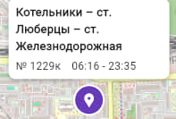

При необходимости окно можно закрыть и открыть снова, нажав на метку ещё раз.

---

## 5. Просмотр общей информации о регионе (ТПУ)

Сервис позволяет просматривать агрегированную аналитику по транспортно‑пересадочному узлу (ТПУ) или региону.

Сделать это можно двумя способами.

### 5.1. Через кнопку региона

В правой нижней части экрана расположена синяя круглая кнопка.  
Нажмите на неё, чтобы открыть общую аналитику по региону.

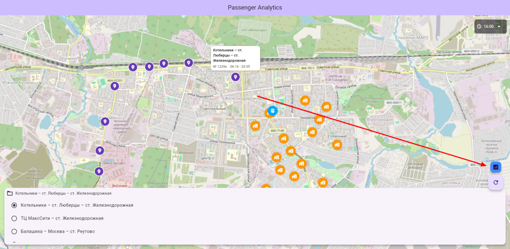

### 5.2. Через иконку региона на карте

1. Найдите на карте иконку ТПУ (синяя метка).
2. Нажмите по ней один раз.
3. Во всплывающем окне нажмите кнопку **«Аналитика»**.

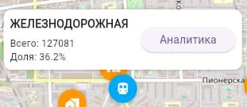

### 5.3. Окно аналитики региона

После перехода открывается отдельная страница с аналитикой по выбранному ТПУ.

Вверху отображаются:

- название ТПУ;
- суточная нагрузка (количество пассажиров в сутки);
- доля ТПУ в общем пассажиропотоке;
- краткая сводка по выбранному часу (входы/выходы).

Ниже представлены основные графики:

1. **По часам (входы / выходы)**  
   График динамики входов и выходов пассажиров по часам суток.

2. **Сравнение по часам (среднее по ТПУ)**  
   Показаны средние значения по разным ТПУ для сопоставления.

3. **Отношение к остальным (пузырьковая диаграмма)**  
   Визуализация нагрузки разных ТПУ относительно друг друга.

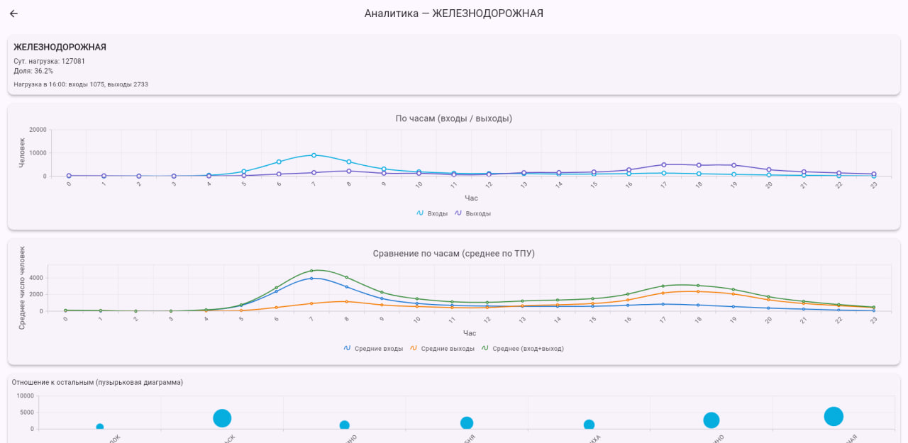

Эти графики позволяют оценить загруженность региона, пики нагрузки и сравнить его с другими узлами.

---

## 6. Информация по новостройкам

Новостройки являются важным фактором при планировании и изменении ТПУ, так как новые жилые комплексы создают дополнительный пассажиропоток и изменяют структуру перемещений.

### 6.1. Отображение новостроек на карте

На карте новостройки отображаются в виде иконки **дома в оранжевом круге**.

При нажатии на такую иконку открывается окно с подробной информацией о здании или комплексе:

- название объекта;
- застройщик;
- группа компаний;
- площадь;
- планируемый срок ввода;
- плотность застройки в выбранном радиусе (например, в 100 метрах).

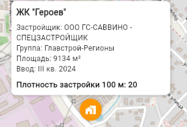

Эти данные учитываются при анализе целесообразности размещения новых остановок и корректировке маршрутов.

---

## 7. Типичные сценарии работы

1. **Оценка новой остановки на существующем маршруте**
   1. Выберите время следования маршрута (раздел 2.1).
   2. Выберите нужный маршрут из списка (раздел 2.2).
   3. Дважды нажмите по предполагаемому месту остановки (раздел 3.2).
   4. Проанализируйте процент целесообразности, расстояние и окружение (раздел 3.3–3.4).
   5. При необходимости сохраните точку или удалите её.

2. **Анализ нагрузки на ТПУ**
   1. Найдите на карте нужный ТПУ и откройте аналитическое окно (раздел 5.2),
      либо нажмите синюю кнопку региона справа внизу (раздел 5.1).
   2. Изучите графики по часам и сравнение с другими ТПУ (раздел 5.3).
   3. Учтите на карте расположение новостроек (раздел 6).

3. **Проверка влияния новостройки на существующий маршрут**
   1. Найдите новостройку на карте и изучите её параметры (раздел 6.1).
   2. При необходимости добавьте новую остановку ближе к объекту (раздел 3).
   3. Сравните показатели до и после изменения маршрута.

---

## 8. Краткое резюме

- Время следования задаётся через иконку часов в правом верхнем углу; оно фильтрует видимые маршруты и точки.
- Выбор маршрута выполняется в нижней части экрана.
- Новая точка добавляется двойным кликом по карте; её параметры и целесообразность отображаются в отдельном окне.
- Существующие точки просматриваются одинарным нажатием по метке.
- Общая аналитика по региону доступна через синюю кнопку или через иконку ТПУ на карте.
- Новостройки отображаются отдельными иконками и активно учитываются при анализе маршрутов и ТПУ.

Работая по этому руководству, вы сможете эффективно использовать сервис TraficData для анализа пассажиропотока и планирования транспортной инфраструктуры.
